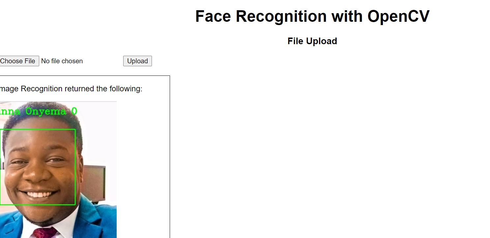

# Face Recognition With OpenCV

In this project we implement face recognition with OpenCV. The first version uses haarcascades as the model to recognize faces. The second version uses the face-recognition module.

## Requirements
### Version 1
* OpenCV
* Numpy
* Webcam.js (for the front end)
* Flask
* werkzeug.utils
* base64

### Version 2
* OpenCV
* Numpy
* Face-recognition

## Implementation & Results
### Version 1
The first version was implemented using [haarcascades](https://github.com/opencv/opencv/tree/master/data/haarcascades).

A front end was developed using Flask to accept input via a webcam, process the image and return a processed image with recognition result.

I had trouble implementing the webcam data capture initially using OpenCV for python. I discovered there was the JS version available as OpenCV.js. However I implemented image capture with Webcam.js and implemented scripts using [this tutorial](https://makitweb.com/how-to-capture-picture-from-webcam-with-webcam-js/).

The captured image is sent to the Flask app for processing via Ajax `XMLHttpRequest()`. The `POST` response contains the processed image filename which the `snapshots.html` page calls to load and display the processed image.

The `faces_train.py` script is used to train the model and then save features and labels arrays as [.npy files](https://machinelearningmastery.com/how-to-save-a-numpy-array-to-file-for-machine-learning/) so that they can be reused without having to train the model every time a face recognition task is to be done.

Apart from capturing images via webcam, I provided a file upload method. When the snapshot page is loaded by a client, the webcam doesn't load if the page isn't served via https. The file upload method allows a user to submit an image for face recognition if this app isn't deployed with SSL certificate.

### Version 2
The second version uses [face-recognition](https://face-recognition.readthedocs.io/en/latest/readme.html) module. 

In order to enhance accuracy of face recognition, I sought to implement the project with a more accurate algorithm. The face-recognition module yielded better results.

The `faces_trainV2.py` script is used to encode faces from training images and save these encoded faces, locations and person names as `.npy` files which can be reused.

Run the `face_recog_videoV2.py` file to open your local webcam (or USB webcam plugged into your computer) and run facial recognition on the video feed.

## Challenges

1. I had no SSL certificate with which to deploy the app so pages couldn't be served via https. This did not allow client browsers to accept use of webcam by a remote server.
2. Performance of haarcascade models are quite weak. There were frequent wrong recognitions.
3. Because of the Ajax `POST` call in `snapshot.html`, `render_template` in the flask app returned a `POST` response instead of displaying the expected webpage on the browser. I discovered there appeared to be a difference between an http POST and form POST. For this reason I elected to receive the filename in the POST response and feed that to `` in the `snapshot.html` page. Refer to details of `@app.route('/snapshot', methods=['GET','POST'])`