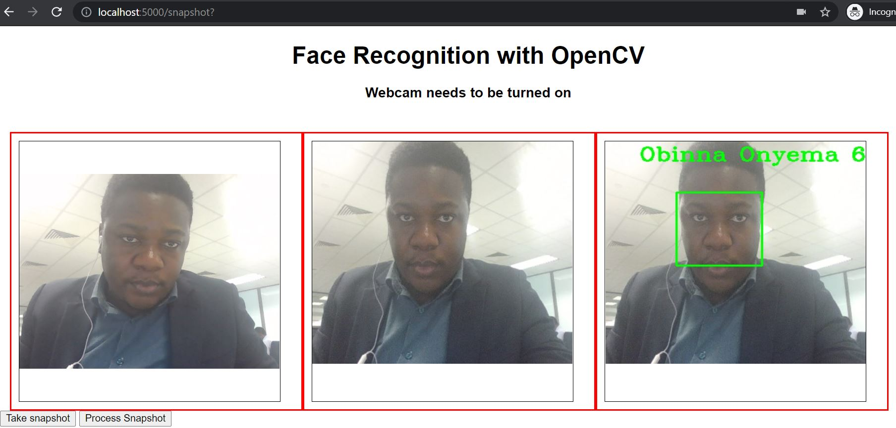

# Face Recognition With OpenCV

In this project we implement face recognition with OpenCV. The first version uses haarcascades as the model to recognize faces. The second version uses the face-recognition module.

## Requirements
### Version 1
* OpenCV
* Numpy
* Webcam.js (for the front end)
* Flask
* werkzeug.utils
* base64

### Version 2
* OpenCV
* Numpy
* Face-recognition

## Implementation
### Version 1
